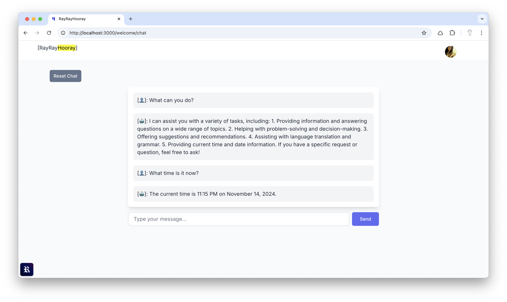
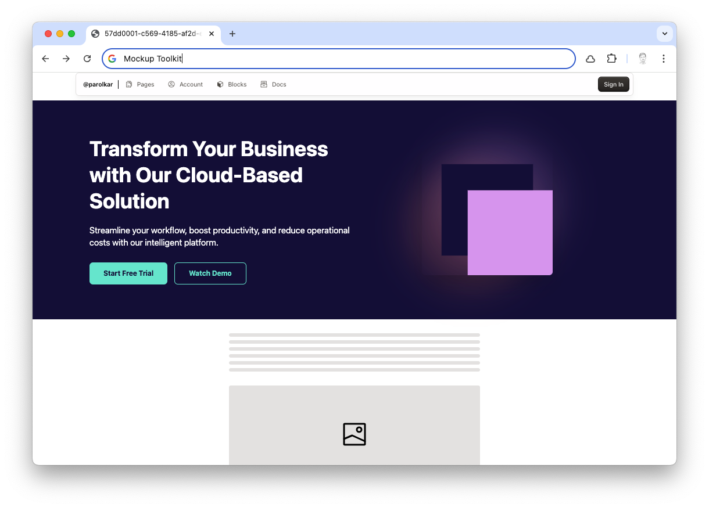

# README

This project aims to simplify the development of LLM applications using Ruby on Rails 8.0.0, RailsUI, and Raix. This guide will help you understand how to set up and use these tools together to build powerful LLM apps efficiently. You can also use [Codebuff](https://codebuff.com/referrals/ref-4b612ec1-6724-47b8-a54d-11da9757ccc3) along with this to develop features with AI.




* Basic Rails 8 Authetication 
* RailsUI ready to use
* Chat Interface and Raix for extensible LLM funcitonality.


# INSTALL (Normal Mode)

```
$ bundle install
$ EDITOR=vim bundle exec bin/rails credentials:edit # to supply your openai keys 
$ bundle exec bin/setup
$ bundle exec bin/dev

```

# INSTALL (on Replit)

You can either start with Replit Template (https://replit.com/@parolkar/RayRayHooray)  or create a fresh replit project by providing this github repo url.
Once you have the project ready, open shell tab and add keys like below.

You may need to add your keys
```
~/RayRayHooray$ EDITOR=vim bundle exec bin/rails credentials:edit  # to supply your openai/open_router keys 

```
The LLM Inference API credentials may look like this.

```
open_router: 
  access_token: <your_key>
openai:
  access_token: <your_key>
```

Once the keys added added, press "run" button. 
You should see error related to "Blocked host".
By default the config hosts may not allow your replit domain so you may need to edit the  config/application.rb and add the replit host names. Something like below.

```
 config.hosts << "2259aadd-YOUR-RANDOM-DOMAIN.sisko.replit.dev"
```

That's it!


## BONUS

If you are looking to do quick prototyping with LLMs , use the following [stand-alone template](public/mockup.html) and iteratively add components.





# LICENSE
Copyright (c) [2025] Abhishek Parolkar

MIT License

Permission is hereby granted, free of charge, to any person obtaining a copy
of this software and associated documentation files (the "Software"), to deal
in the Software without restriction, including without limitation the rights
to use, copy, modify, merge, publish, distribute, sublicense, and/or sell
copies of the Software, and to permit persons to whom the Software is
furnished to do so, subject to the following conditions:

The above copyright notice and this permission notice shall be included in all
copies or substantial portions of the Software.

THE SOFTWARE IS PROVIDED "AS IS", WITHOUT WARRANTY OF ANY KIND, EXPRESS OR
IMPLIED, INCLUDING BUT NOT LIMITED TO THE WARRANTIES OF MERCHANTABILITY,
FITNESS FOR A PARTICULAR PURPOSE AND NONINFRINGEMENT. IN NO EVENT SHALL THE
AUTHORS OR COPYRIGHT HOLDERS BE LIABLE FOR ANY CLAIM, DAMAGES OR OTHER
LIABILITY, WHETHER IN AN ACTION OF CONTRACT, TORT OR OTHERWISE, ARISING FROM,
OUT OF OR IN CONNECTION WITH THE SOFTWARE OR THE USE OR OTHER DEALINGS IN THE
SOFTWARE.
